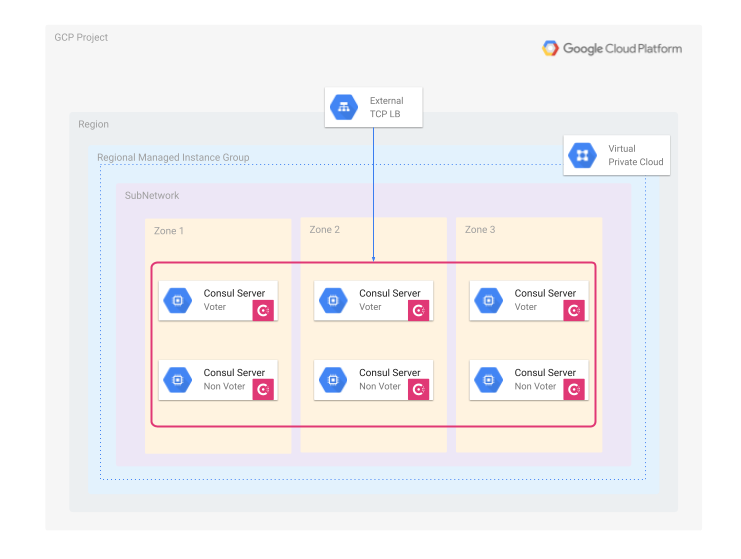

# Terraform Config to Deploy Consul Enterprise Servers in GCP

> NOTE: This is still a **Work In Progress**...

This Terraform configuration will deploy Consul Enterprise control plane servers based on the recommeded architecture from [HashiCorp Validated Designs](https://developer.hashicorp.com/validated-designs/consul-solution-design-guides-consul-enterprise-self-hosted/consul-on-aws-ec2).



## Requirements

* A GCP Service Account with permissions to create Networks and Compute instances
* HashiCorp Terraform
* HashiCorp Packer
* Some terminal knowledge

## Build and Deploy
You will create the required infrastructure and deploy the Consul servers by creating first a cloud image and then creating the instrastucture using that image, like in the below diagram:

.png)

### Create your Packer image

You first need to create your Packer image with the included Packer configuration in `packer/gcp` from this repo.

Create your variables file first (replace your values):

```
cat - | tee ./packer/gcp/consul_gcp.auto.pkvars.hcl <<EOF
consul_version = "1.19.0+ent"
image = "consul-ent"
image_family = "hashistack"
sshuser = "packer"
owner = "<YOUR_ALIAS>"
gcp_project = "<YOUR_GCP_PROJECT_ID>"
source_image_family = "debian-12"
EOF
```


```
packer build -var-file ./packer/gcp/consul_gcp.auto.pkvars.hcl ./packer/gcp/consul_gcp.pkr.hcl
```

> NOTE: You can use [HCP Packer](https://developer.hashicorp.com/hcp/docs/packer) by selecting the `./packer/gcp/consul_gcp_hcp.pkr.hcl` template instead of the one used in the command:
> ```
> packer build -var-file ./packer/gcp/consul_gcp.auto.pkvars.hcl ./packer/gcp/consul_gcp_hcp.pkr.hcl
> ```
>
> Bear in mind that you will need to configure your HCP environment variable credentials (*HCP_CLIENT_ID* and *HCP_CLIENT_SECRET*)

### Deploy Consul servers with Terraform

Once your Packer image is created you can deploy Consul servers based on the previous image.

First, create your Terraform variable values (replace your own values):
```
cat - | tee ./terraform/terraform.auto.tfvars <<EOF
gcp_region = "europe-southwest1"
gcp_project = "<YOUR_GCP_PROJECT_ID>"
gcp_instance = "n2-standard-2"
numnodes = 6
# One of the names that you should see from "gcloud iam service-accounts list --format="table(NAME)""
gcp_sa = "<GCP_SERVICE_ACCOUNT_ID>"
cluster_name = "gcp-demo"
# Use the image family used previously in your Packer image creation
image_family = "hashistack" # This is the value used when building the Packer image
owner = "<USE_ALIAS>"
consul_license = "<CONSUL_ENT_LICENSE_STRING>"
# Set this to false if you want to use Consul CA generation
create_certs = true
EOF
```

Init your Terraform config:
```
terraform -chdir=./terraform init
```

Deploy the Consul servers:
```
terraform -chdir=./terraform apply
```

> NOTE: This configuration is using locally self-signed certificates created by Terraform with the TLS provider. If you define `create_certs = false`, the certificates for the server will be created using `consul tls` [CLI command](https://developer.hashicorp.com/consul/commands/tls) (which are also self-signed)

> NOTE: If you used HCP Packer previously you can use the golden image created by including `use_hcp_packer = true` in your `terraform.auto.tfvars` file.


## Outputs and connect to Consul

Check the Terraform outputs:
```
terraform -chdir=./terraform output
```

So if you want to configure Consul variables:
```
export CONSUL_HTTP_ADDR=$(terraform -chdir=./terraform output -raw CONSUL_HTTP_ADDR)
export CONSUL_HTTP_TOKEN=$(terraform -chdir=./terraform output -raw CONSUL_HTTP_TOKEN)
```

```
terraform output -raw consul_ca > /tmp/consul_ca.pem
export CONSUL_CACERT=/tmp/consul_ca.pem
```

Now you can check all the servers, voters and non voters, from your Consul cluster:
```
$ consul operator raft list-peers
Node                                                   ID                                    Address        State     Voter  RaftProtocol  Commit Index  Trails Leader By
server-90sm.c.hc-b38aad749ea448d9a1e87df9480.internal  d2756751-46cb-6a32-487b-b4fe17ec58c6  10.2.0.5:8300  follower  true   3             39564         0 commits
server-69t6.c.hc-b38aad749ea448d9a1e87df9480.internal  db41161d-158b-6572-3e94-7e4783fd15c0  10.2.0.3:8300  leader    true   3             39564         -
server-n762.c.hc-b38aad749ea448d9a1e87df9480.internal  2c139d20-56bb-3d17-fc72-b27fe0972ecd  10.2.0.6:8300  follower  true   3             39564         0 commits
server-czp7.c.hc-b38aad749ea448d9a1e87df9480.internal  73da7e51-4bd8-1b04-7874-616cc5b9d83a  10.2.0.7:8300  follower  false  3             39564         0 commits
server-7kxg.c.hc-b38aad749ea448d9a1e87df9480.internal  358d8dd4-e0b3-df79-bc55-207fbae12d3b  10.2.0.2:8300  follower  false  3             39564         0 commits
server-0zbb.c.hc-b38aad749ea448d9a1e87df9480.internal  773fd8dd-71a3-8dcf-af44-c69b741be06e  10.2.0.4:8300  follower  false  3             39564         0 commits
```


